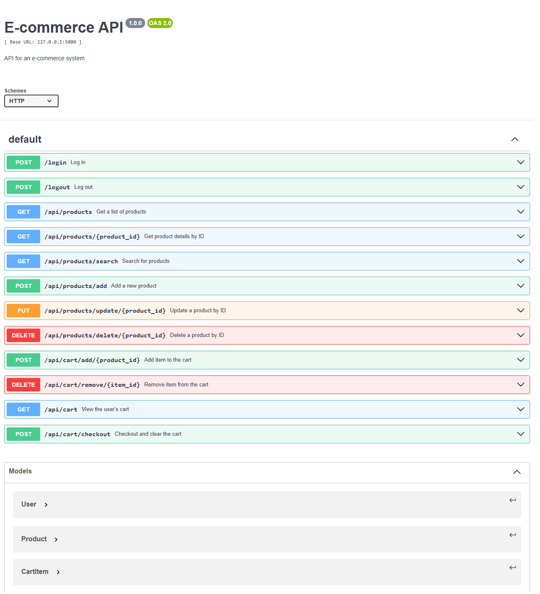

<h1 align="center">Ecommerce Api</h1>

API para uso de ecommerce, com função de login, logout, a posibilidade da adição do produto ao carrinho, desenvolvida junto curso da RockeatSeat.

## 🚀 Tecnologias

- Python
- Flask
- Sqlite
- Swagger
- ORM